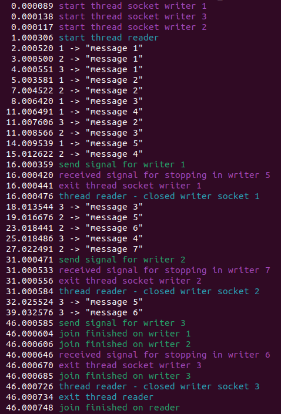

# select

Работают следующие потоки:
- Главный поток - запускает потоки писателей и читателя, для каждого писателя создает pipe. Через определенный интервал времени отправляет сообщение через pipe в очередной писатель, которое приводит к завершению работы этого писателя. После этого дожидается завершения работы всех потоков.
- "Писатели" - создается WRITERS_NUMBER (=3) штук. Каждый писатель создает unix socket, ждет когда подключится читатель и через определенный таймаут отправляет читателю сообщение. Во время таймаута через pipe может прийти сообщение о завершении работы, это сообщение отлавливается через select.
- "Читатель" - открывает unix сокеты всех писателей. Через select отслеживает появление в одном из сокетов нового сообщения, которое выводится на экран. Когда все сокеты закрываются, читатель завершает свою работу.

